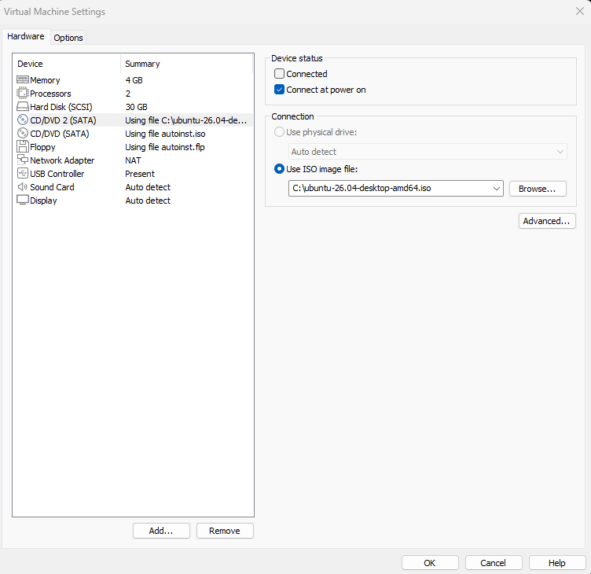
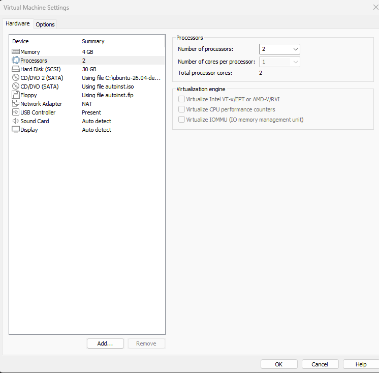
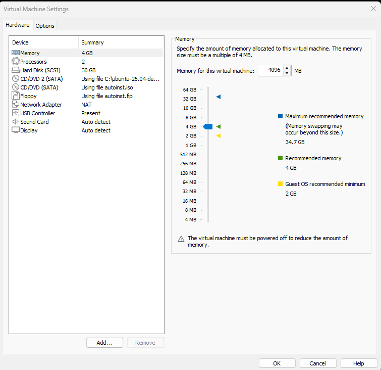
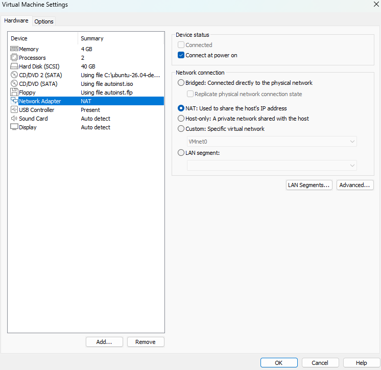
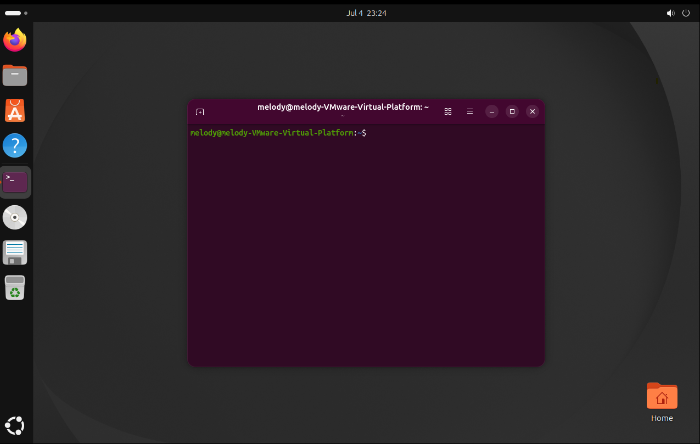

# 1a-1: Virtualisation & Linux Setup

I used VMWare Workstation to run the Ubuntu machine and used the configurations provided in the lab to configure my machine. The steps are the same as VirtualBox despite the environment being different.

## Configuration Screenshots

The Virtual Machine is running on Ubuntu amd64.iso image file

Virtual Machine is configured with 2 processors

Memory configured at 4 GB

Networking Mode configured as NAT

Ubuntu Installation Success -- can open the terminal from the GUI

My machine also has internet access

## Reflection

**What are the advantages of using virtual machines for testing and development?**

A virtual environment is controlled and you can run tests and install software without affecting your host computer, or risk exposing your host computer to malware/virus attacks.

**What challenges did you face during installation or network setup?**

I initially had issues connecting my Virtual Machine to the internet, so I had to toggle between using NAT and Bridged for the VMWare. The Ubuntu also took a long time to load.

**What are the differences between NAT and Bridged networking in VirtualBox?**

**NAT:** The VM shares your host machine's network connection, gets a private IP address (something like 192.168.x.x) that only exists inside VirtualBox's internal virtual network — your host's network (and the internet) doesn't know that IP exists.

**Bridged:** The VM gets its own IP address from your actual router/DHCP server, on the same network segment as your host machine.

**What did you learn about Linux distributions (distros) from your reading?**

I learnt that a Linux distro is the kernel bundled with a package manager, tools and sometimes a desktop environment to make it a full OS.
