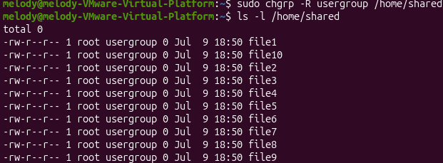

Files have been shared successfully

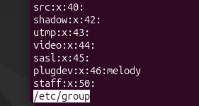

Using less /etc/group to prove that the folder has been created

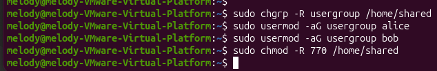

Setting group ownership and adding Alice and Bob to the group. Also setting directory/file permissions.

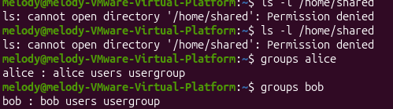

Melody user should not have access to the shared directory and only Alice and Bob are in the usergroup

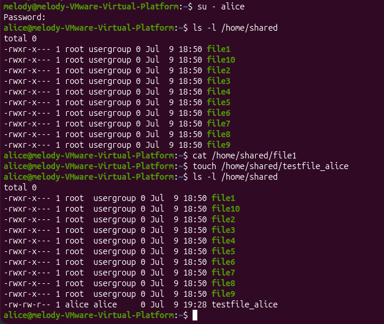

Testing Read, write and execute functions for alice

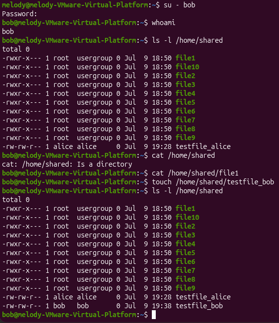

Testing Read, write and execute functions for bob

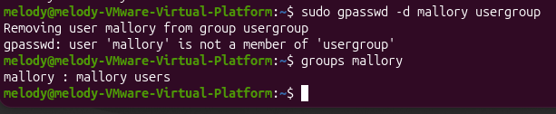

Removing Mallory from any groups with access and confirming that she is not in any group

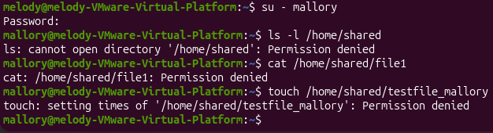

Testing permissions for Mallory, all read, write and execute permissions are denied. This is because Mallory is not in the **usergroup**, thus she has not been granted any read, write or execute permissions for the shared folder.

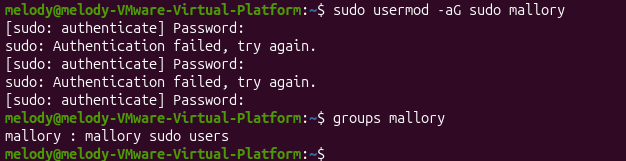

Adding Mallory to the super users group. Mallory has been added to the super user group

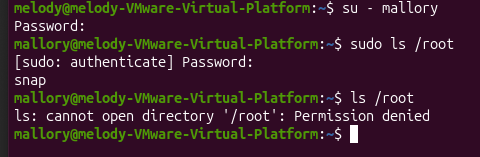

Mallory's permissions have been changed to super user, but she does not have root privileges since she is a super user and not a root user. So when performing commands I have to use sudo to execute them and be granted permission

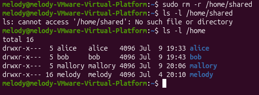

Performing the clean up task to remove the shared folder, and doing **ls** command to ensure that the folder has been deleted successfully

## Reflection Questions

**How do Linux permissions differ from Windows ACL?**

Linux permissions are based on a fixed structure -- owner, group and others, so control is limited to these three categories, and permissions can only be set at the group or directory level, not per individual user. For example, during the lab I tried to grant Alice and Bob different levels of access (read and write/ read only) but but because Linux permissions don't support per-user rules within a shared group, both ended up with the same effective access regardless of the file-level settings I applied.

Windows ACL, by contrast, allows individual, rule-based permissions to be set per user or group directly on a file or folder, offering finer-grained control without needing a separate group every access variation, which would have let me grant Alice and Bob different access levels.

**What's the effect of chmod 770 vs 750?**

Chmod 770 gives owner and group read, write, and execute permissions, and no permissions to others. This is why Mallory had no access at all --- she wasn't a member of the group, so she fell into the "others" category.

Chmod 750 gives owner read and write and execute permissions, group only read permissions, without any write and execute permissions. And users have no permissions.

**What is the risk of adding users to the sudo group?**

Adding users to the sudo group gives them extra permissions that regular users don't have, such as accessing sensitive files or deleting folders. If misused, a user could take advantage of these privileges for malicious activity, like viewing or deleting sensitive information.

**Why is it important to verify with `su` and `whoami`?**

su lets you switch into another user's account so you can test what that specific user can and can't access. whoami confirms which user account you're currently acting as, so you know the permission test you're running is actually accurate for that user.
