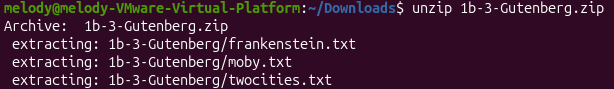
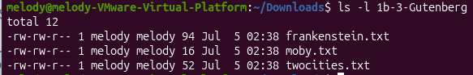
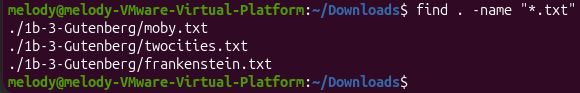
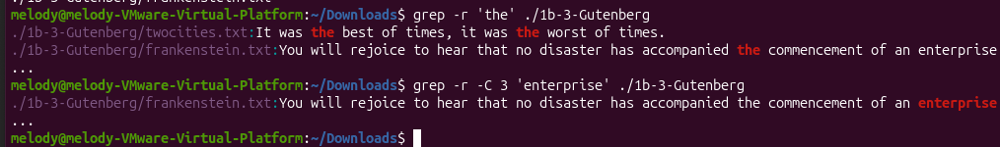
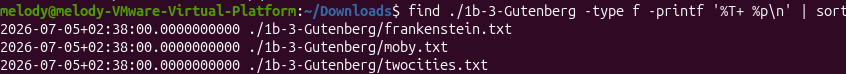
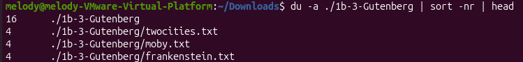
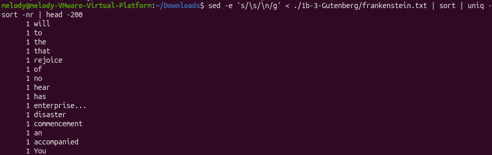

# File Search, Analysis & Archiving in Linux

Using unzip to extract the text files from the Gutenberg folder

`ls -l 1b-3-Gutenberg` listing the three extracted files

Performing `find . -name "*.txt"` in the Downloads folder — output correctly returning the three extracted Gutenberg files (Filename search)

`grep -r 'the' ./1b-3-Gutenberg` (text search) then `grep -r -C 3 'enterprise' ./1b-3-Gutenberg` (contextual search with 3 lines of surrounding context)

`find ./1b-3-Gutenberg -type f -size 94c -exec ls -lh {} \;` → frankenstein.txt (Size based search)

`find ./1b-3-Gutenberg -type f -printf '%T+ %p\n' | sort` (Date based search)

Using `du -a` to search for the largest file size

Word frequency analysis on Frankenstein.txt — using `sed` to split the text into one word per line and sort to count and rank each word by frequency
