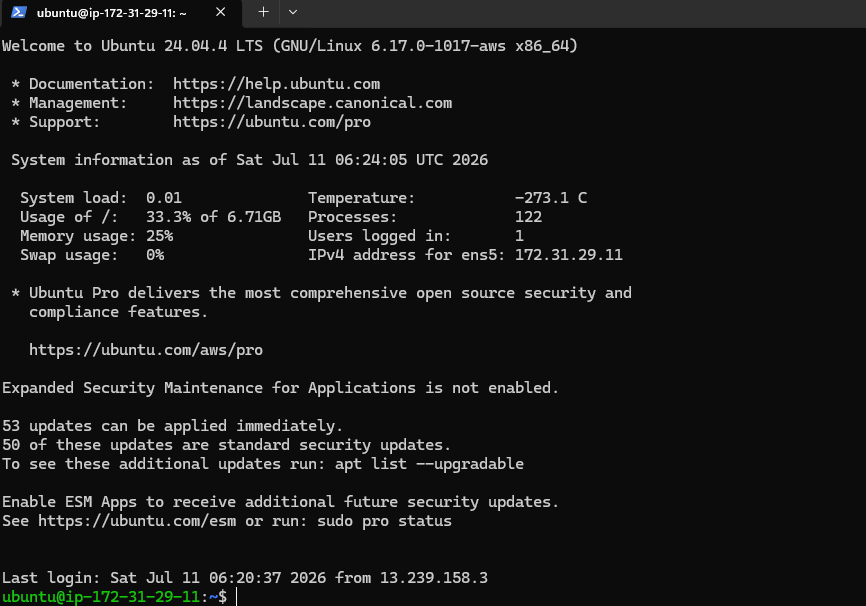
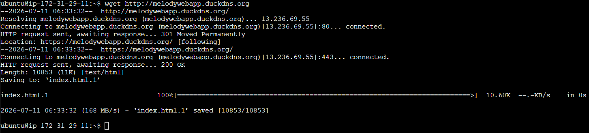
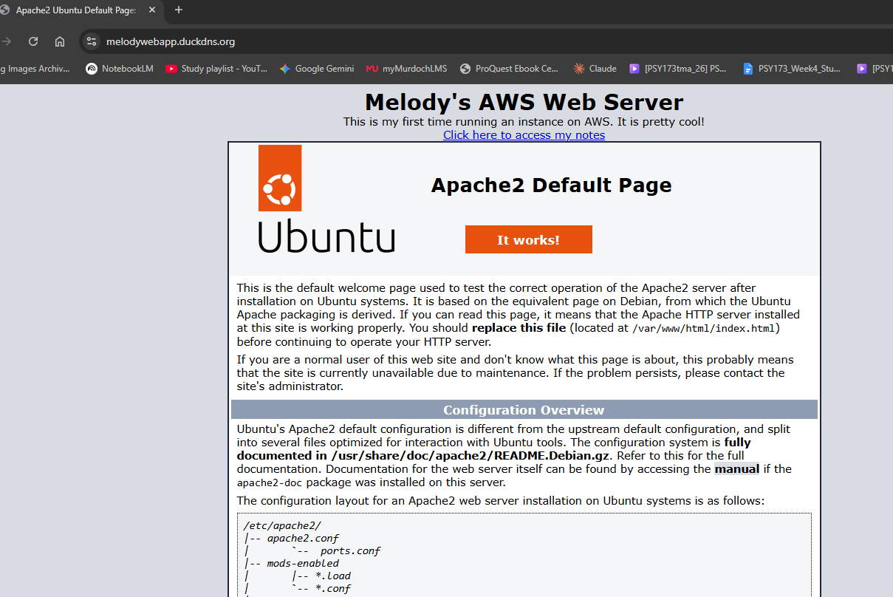
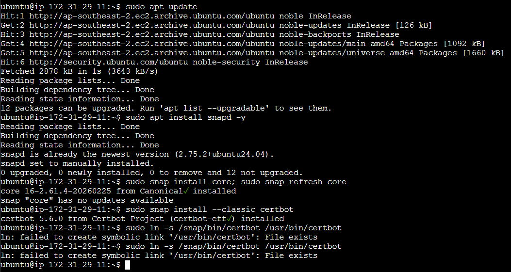
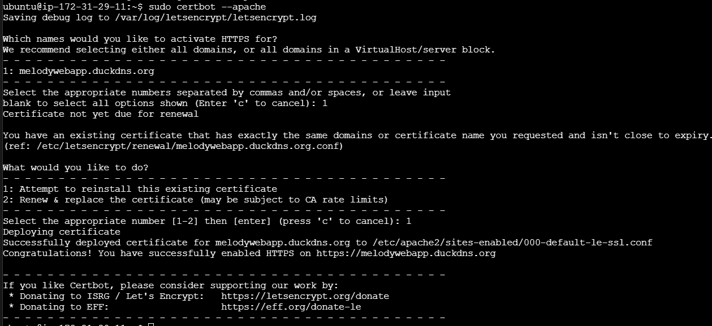
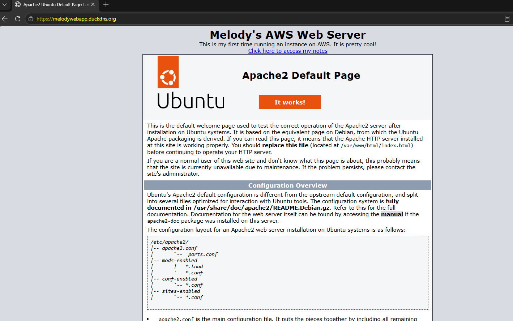
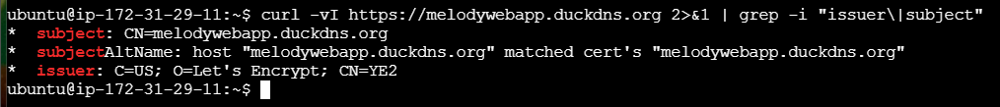
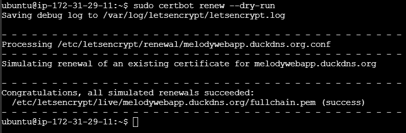
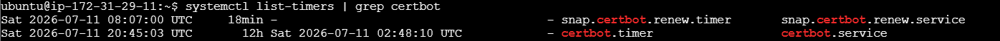

# Lab 3a-2: Enabling HTTPS with Let's Encrypt & Certbot

**Learning Outcome:** Secure a cloud-hosted web service using TLS encryption by obtaining and installing a free digital certificate from Let's Encrypt via Certbot.

**Environment:** AWS EC2 (Ubuntu 24.04 LTS), Apache2, domain via DuckDNS (`melodywebapp.duckdns.org`)

---

## Pre-Requisites Verified

- Domain name (`melodywebapp.duckdns.org` via DuckDNS) with an A record pointing to the EC2 instance's public IP
- Apache2 installed and running on the instance
- Ports 22, 80, and 443 open in the AWS security group


*SSH access confirmed to EC2 instance.*

> **Note:** During this lab, the EC2 instance's public IP changed (no Elastic IP attached), which broke the DuckDNS A record. This was resolved by updating the DuckDNS record to the instance's new public IP before proceeding.


*Verifying HTTP access and automatic redirect to HTTPS via `wget`.*


*Confirming the site loads correctly via browser.*

---

## Step 1: Install Certbot via Snap

```bash
sudo apt update
sudo apt install snapd -y
sudo snap install core; sudo snap refresh core
sudo snap install --classic certbot
sudo ln -s /snap/bin/certbot /usr/bin/certbot
```


*Installing Certbot via Snap.*

---

## Step 2: Run Certbot for Apache

```bash
sudo certbot --apache
```

Certbot detected an existing certificate already covering `melodywebapp.duckdns.org` and not close to expiry, and offered the option to reinstall or renew/replace. The existing certificate was reinstalled.


*Certbot detecting and reinstalling the existing certificate for melodywebapp.duckdns.org.*

---

## Step 3: Verify HTTPS in Browser


*Verifying that the browser is running on HTTPS — lock icon visible in the address bar.*

---

## Step 4: Verify Certificate Issuer

Local antivirus (Avast Web/Mail Shield) was intercepting HTTPS traffic and presenting its own re-signed certificate in-browser, which masked the actual issuer. This was resolved by verifying the certificate directly from the server using `curl`, bypassing the local interception:

```bash
curl -vI https://melodywebapp.duckdns.org 2>&1 | grep -i "issuer\|subject"
```


*Verifying that the certificate is issued by Let's Encrypt using the `curl` command, as antivirus web shield protection prevented viewing the actual certificate directly in-browser.*

---

## Step 5: Certbot Auto-Renewal Dry Run

```bash
sudo certbot renew --dry-run
```


*Certbot auto-renewal dry run successful.*

---

## Step 6 (Optional): Confirm Auto-Renewal Is Scheduled

```bash
systemctl list-timers | grep certbot
```


*Confirming certbot auto-renewal is scheduled via systemd timers (`snap.certbot.renew.timer` and `certbot.timer`).*

---

