# 3b-1 Bash Backup Scripting, Cron Jobs & Cloud Export – Lab walkthrough and screenshots

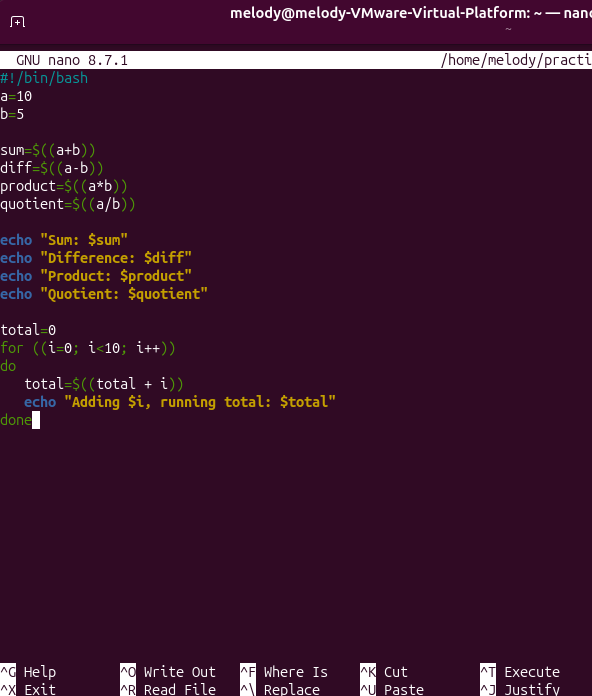

Adding basic calculations and echo variables in the script

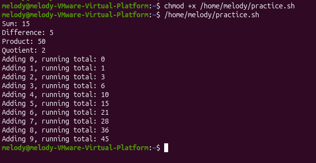

Executing the script and seeing the results of the calculations performed by the script

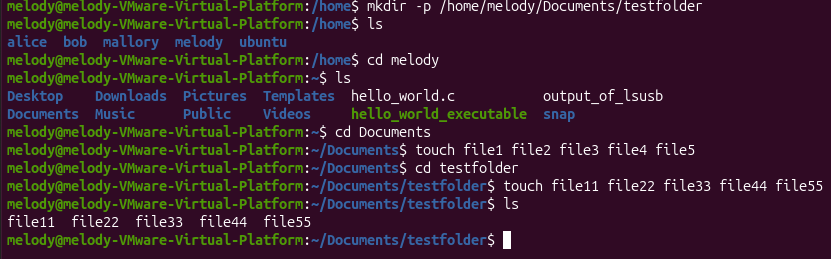

Making testfolder, creating the files and adding the files to the testfolder

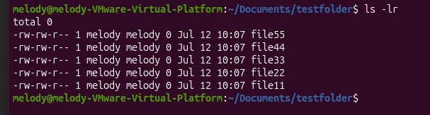

Ls -r output showing test files and testfolder created in /home/melody/Documents

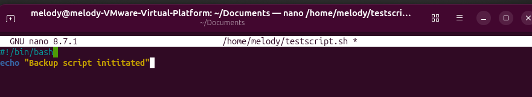

Creating the backup script -- using echo

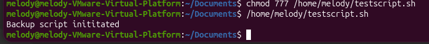

script initiated successfully -- can see the content of the backup script that I created

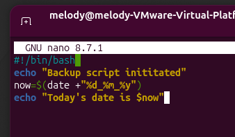

Adding timestamp to the filename

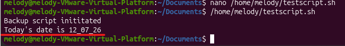

the date and time is printed successfully

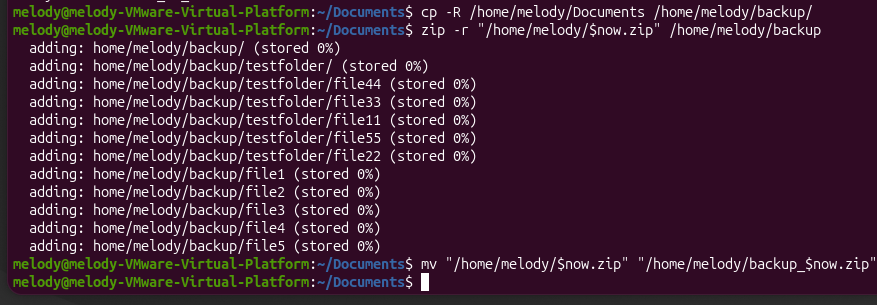

Creating the ZIP Archive with Date Filename

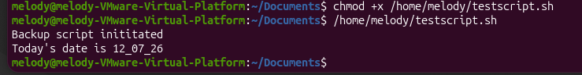

Setting permissions and testing the script again

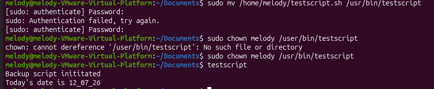

Making the script globally accessible

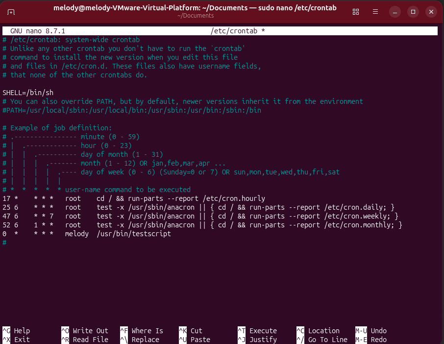

Scheduling the testscript to run every hour by using a cron job to automate it

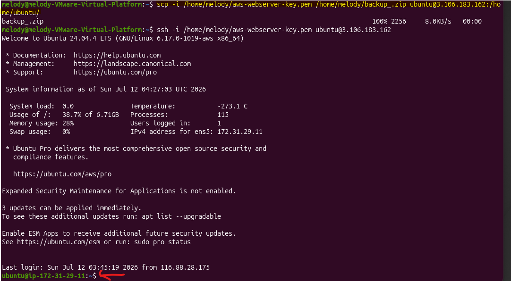

Using SCP to transfer the files from my Ubuntu VM to the remote server (Amazon EC2 instance)

After that, I connected to my instance using ssh. In this screenshot, ssh is successful, so I am currently inside the Ec2 instance

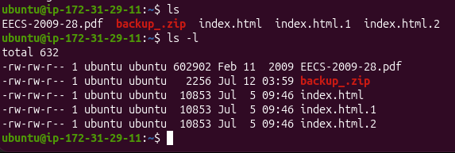

Using ls to verify that the backup_.zip folder has been transferred successfully

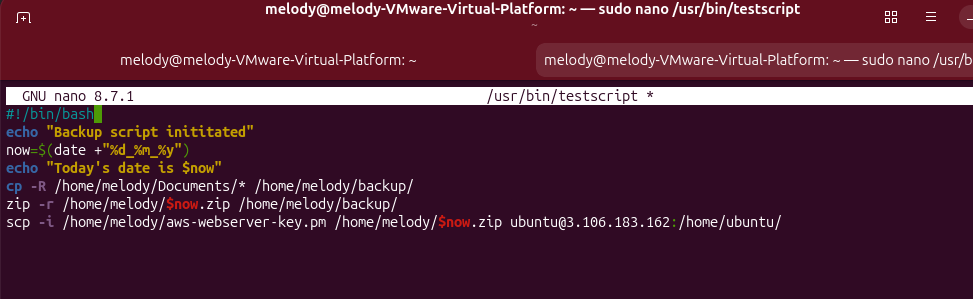

Adding all the commands I did previously into the testscript so that I can automate it without retyping the commands physically each time.

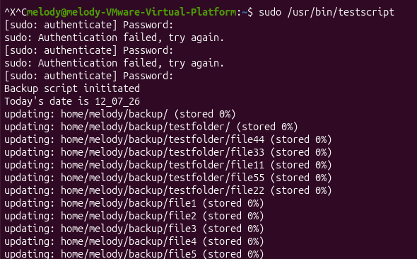

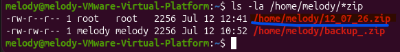

After initiating the script, a new zip folder is created on the VMware

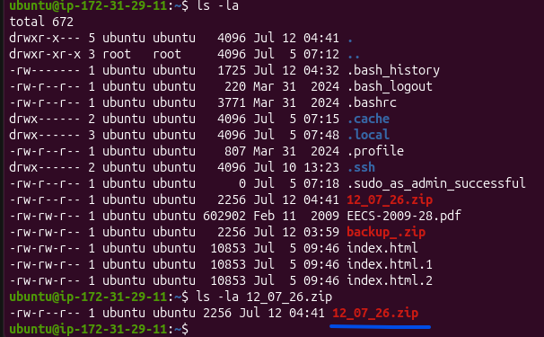

I logged into the my EC2 instance via ssh to check if the zip folder has been copied successfully. Using ls -la, I can see that the new zip folder has been copied to the EC2 instance

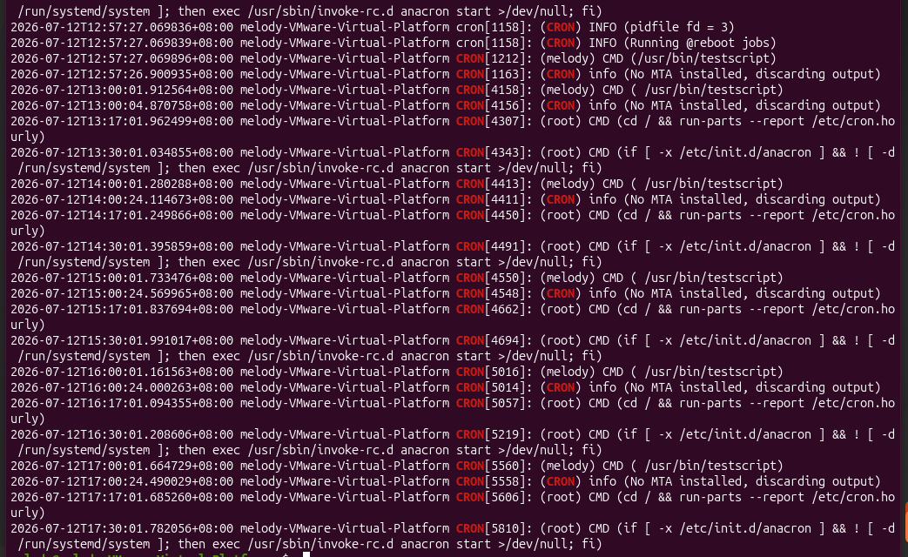

Using /var/log/syslog to verify that the cron job executed automatically every hour as melody user
