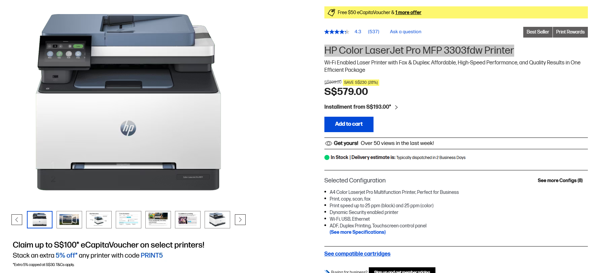
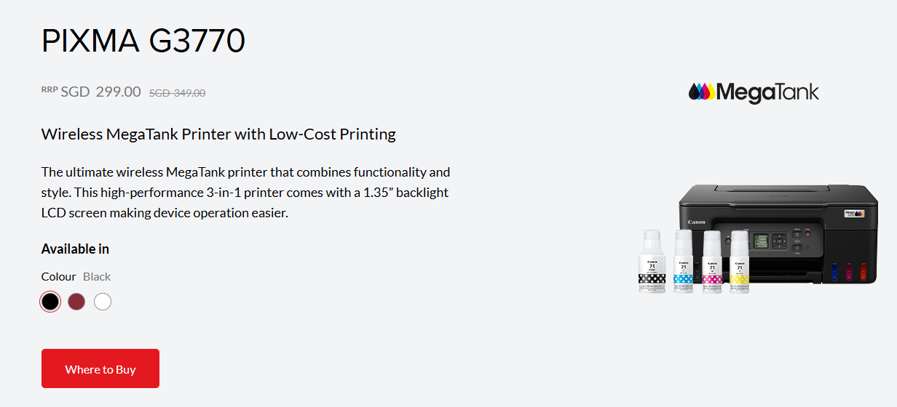
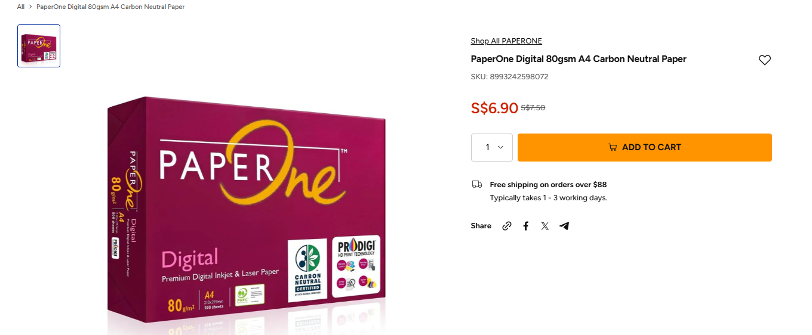
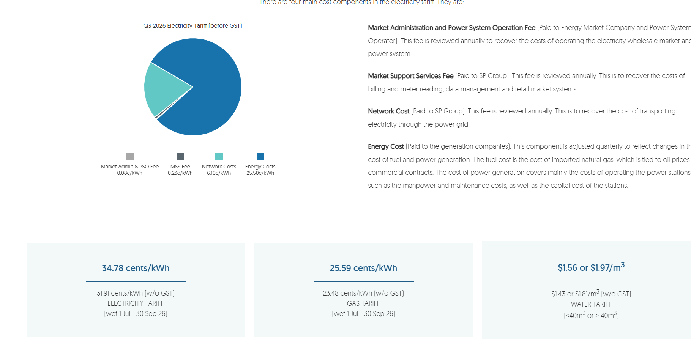

# 2a-1: Total Cost of Ownership (TCO) Analysis — Printer Comparison

## Printers Compared

### Office Printer

**Model Name:** HP Color LaserJet Pro MFP 3303fdw Printer

- **Price:** SGD $809.00
- **Type:** LaserJet
- **Printer Lifespan:** Est. 10 years
- **Duty Cycle:** 40,000 pages/month
- **Recommended monthly volume:** 40,000 pages/month
- **Black toner yield:** ~1,300 pages
- **Color toner yield:** ~1,200 pages

### Home Printer

**Model Name:** Canon PIXMA G3770

- **Price:** SGD $349.00
- **Type:** InkJet
- **Printer Lifespan:** Est. 5–7 years
- **Duty Cycle:** 3,000 pages/month
- **Black ink yield:** 6,000 pages (standard) / 7,600 pages (economy mode)
- **Color ink yield:** 7,700 pages each (standard) / 8,100 pages (economy mode)

### Printer Paper (Challenger)

SGD $7.50 (per ream, 80gsm A4)

### Electricity Rate in Singapore

34/78 cents/kWh — same charges apply for both printers

## Unit Cost Sources

- [Canon PIXMA G3770 product page](https://sg.canon/en/consumer/pixma-g3770/black/product)
- [HP Color LaserJet Pro MFP 3303fdw](https://www.hp.com/sg-en/shop/hp-color-laserjet-pro-mfp-3303fdw-499m8a.html)
- [SP Group electricity tariff information](https://www.spgroup.com.sg/our-services/utilities/tariff-information)
- [HP ink & toner store](https://www.hp.com/sg-en/shop/ink-toner/toner.html)
- [Canon PIXMA G3770 TCO / ink cost page](https://sg.canon/en/consumer/pixma-g3770/black/tco)

## Assumptions

- Comparison period: 5 years
- Pages printed per week: 750
- Power usage per week: 40 hours
- Cost of electricity per kWh: 34/78 cents/kWh
- Cost of paper (80gsm A4): same for both printers

## Calculations

**Total pages over a 5-year period:**
- 750 pages/week × 52 weeks/year × 5 years = 195,000 pages

**Reams needed:**
- 195,000 pages ÷ 500 sheets/ream = 390 reams

**Paper cost** (S$7.50/ream):
- 390 reams × S$7.50 = S$2,925.00 — same for both printers

**Ink/toner yield per cartridge:**
- Canon: 7,700 pages (color), 6,000 pages (black)
- HP: ~1,300 pages (black and color)

## Reflection Questions

**Based on the TCO, which printer is the most cost-effective over 5 years?**

Based on the TCO, the Canon Pixma is more cost-effective because the total TCO over 5 years is $4,155.45, which is $36,247.63 less than the HP Printer.

**Would the answer change for a home user who prints only 5 pages per week?**

Because the printer takes up lesser electricity when it sits idle, compared to when it is used for printing, printing, ink and electricity costs will go down if the printer is only used to print 5 pages a week. However, the answer will not change, and the Canon printer will still be the more cost-effective due to its smaller upfront cost, regardless of variable costs.

**What other non-financial factors could influence printer selection?**

- The years of warranty that come with each printer — different companies and printer type, different amounts of warranty
- Speed — how fast does the printer take to print one page? (Assume we print double-sided)
- Reliability — how long can the printer last without needing repairs/servicing if used for 5 years? For example, does the printer require repairs every year because it breaks down easily?
- Environmental impact — carbon footprint of the printer — does it consume a lot of electricity even when it's idle? Are the print cartridges recyclable?

**What cost components are more significant for a large workgroup printer?**

At high print volumes, variable costs — particularly toner cartridges and electricity — become far more significant than the fixed printer purchase price. For the HP printer, toner (both black and color toners) alone accounts for $36,050.70 of its $40,403.08 total 5-year TCO, compared to just $809 for the printer itself, because the color cartridges are expensive (~$116.70 each) and are consumed quickly at this volume. This shows that for a large workgroup printer, ongoing consumable and running costs — not the upfront hardware price — should be the priority when evaluating cost-effectiveness.

**At what point (in years/pages) do the two printer options break even in cost?**

The upfront cost of the HP printer costs $460 more than the Canon printer and the HP printer costs more per page as well. According to my calculations, each year, the cumulative cost of the HP printer per year is significantly more than the cumulative cost of the Canon Printer. Therefore, there is no point within the 5 year assumption that the two printer options break even in cost.
